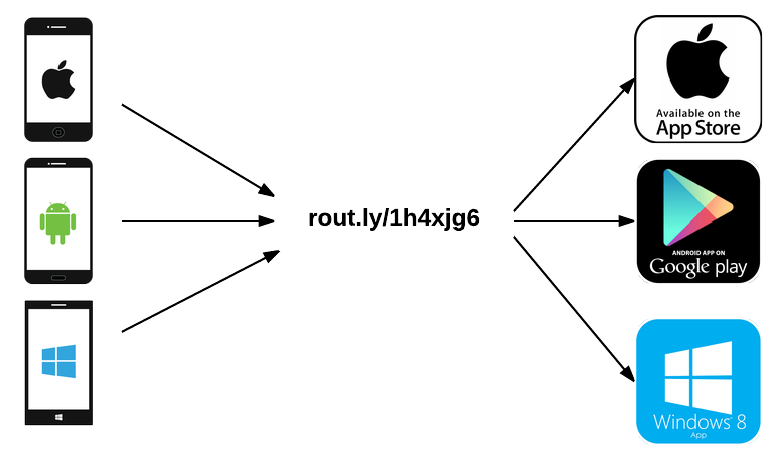

# route
If a developer wants to launch a new app or push out a major update, they post links to every appstore their app is available on. The users have to decide which one works for their device.

Wouldn't it be great if there was just one short link, which automatically routes them to the corresponding appstore. Thats exactly what route does.
It lets you add links to all appstores and provides a simple short link. If a user touches the link, the services determines the appstore based on the user agent string and routes to that appstore.

## How it works



Let's say we want to inform people about an update
about the game [Shoggoth Rising](http://shoggothrising.com/en/).

We use [express-useragent](https://github.com/biggora/express-useragent) for
detecting mobile platforms and redirect according to the table below.

Client        | Redirection
--------------|---------
iPad          | [App Store](https://itunes.apple.com/app/shoggoth-rising/id729429892)
iPod          | [App Store](https://itunes.apple.com/app/shoggoth-rising/id729429892)
iPhone        | [App Store](https://itunes.apple.com/app/shoggoth-rising/id729429892)
Android       | [Google Play](https://play.google.com/store/apps/details?id=ch.dreipol.shogothrising)
Windows Phone | [Windows Store](http://apps.microsoft.com/windows/en-us/app/shoggoth-rising/99e6a9ff-8fc8-4938-a25d-6a5519965ade)

## Build

You need gulp to run the tests.

```
npm install -g gulp
```

Now you can execute the tests and lint the project.

```
gulp
```
